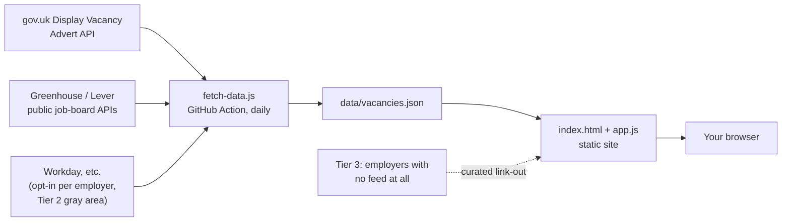

# UK Apprenticeship Board

A free, static job board listing UK apprenticeships — searchable and
filterable by sector, location, and level.

## Why this doesn't scrape Indeed/Reed/Totaljobs — and why gov.uk alone isn't enough either

You asked for scraping, but that's not the right tool, and I built something
better instead — though it turns out one free source isn't enough on its
own either, so this is a **layered pipeline**, not a single feed.

Think of UK apprenticeship listings as living in three different kinds of
building:

1. **The government noticeboard.** Every apprenticeship that goes through a
   training provider using the standard recruitment route gets posted to
   **Find an apprenticeship** (<https://www.gov.uk/apply-apprenticeship>),
   and DfE runs a free, public **Display Vacancy Advert API** specifically
   so other sites can display those listings. This is the biggest single
   free, legal source, and the backbone of this board.
2. **Company-run shopfronts with a public order window.** Some large
   employers only advertise on their own careers site — but many of those
   sites are built on recruiting platforms (Greenhouse, Lever, and similar)
   that publish a **free, documented, public API** precisely so job boards
   can pull their listings. No permission needed, no ToS conflict — the
   vendor built it for this.
3. **Company-run shopfronts with the door shut.** Other employers (Dyson
   included — their careers site runs on Workday) have no such public feed.
   Their site's own search box does call a JSON endpoint behind the scenes,
   but that endpoint isn't documented or sanctioned for outside use, and
   whether pulling from it is fine depends on *that employer's* own website
   terms, not ours to assume. Indeed/Reed/Totaljobs sit here too, except
   they go further and explicitly ban automated access in their Terms of
   Service and block it via `robots.txt` — so those are off the table
   entirely, not just gray-area.

This board handles all three honestly instead of pretending one API covers
everything:

| Tier | Examples | How it's fetched | Enabled by default? |
|---|---|---|---|
| 1 — sanctioned API | gov.uk, Greenhouse, Lever, Workable, SmartRecruiters | Documented public endpoints | gov.uk: yes (with a key). ATS: per employer, in `sources.config.json` |
| 2 — gray area | Dyson, Rolls-Royce, Lloyds Banking Group (all Workday) | Same JSON the browser calls; undocumented for 3rd parties | **No** — off until you set `confirmedTermsChecked: true` after reading that employer's own terms yourself |
| 3 — no feed at all | Jaguar Land Rover (SuccessFactors), National Grid | Not fetched — just linked | Always shown as a plain link-out card, never merged into the vacancy list |

### So how many big employers can we actually just switch on?

I checked several flagship UK apprenticeship employers directly (fetching
their real endpoints, not guessing) and the honest answer is: **fewer than
you'd hope, among the household names** — and it's worth knowing why before
you go looking for more.

| Employer | Platform found | Tier |
|---|---|---|
| Dyson | Workday | 2 (gray area) |
| Rolls-Royce | Workday — verified live, returned a real posting | 2 (gray area) |
| Lloyds Banking Group | Workday — verified live, endpoint healthy (0 open right now; window opens in Nov) | 2 (gray area) |
| Jaguar Land Rover | SAP SuccessFactors | 3 (no connector built yet) |
| National Grid | Beamery (talent CRM) + unconfirmed ATS | 3 |
| BAE Systems | Not identified from public info | 3 (unconfirmed) |
| BT Group | Not identified from public info | 3 (unconfirmed) |

The pattern: **Greenhouse/Lever/Workable/SmartRecruiters (Tier 1, no
permission needed) skew towards tech and scale-up employers.** The
traditional big apprenticeship providers — aerospace, banking, utilities,
manufacturing — run enterprise ATS platforms (Workday, SuccessFactors,
Avature, Beamery) built for large-company HR, and none of those vendors
publish a sanctioned public read API. So for exactly the employers people
usually mean by "one-stop shop" (Rolls-Royce, BAE, Lloyds, JLR, National
Grid...), Tier 2/3 is where they'll actually land, not Tier 1.

I also learned something else useful while checking: these employers'
*marketing* careers pages (careers.company.com) sit behind bot-protection
that flat-out blocks a plain server-side fetch (403, even with a browser
User-Agent) — but the underlying ATS itself, once you know its actual
address (e.g. `rollsroyce.wd3.myworkdayjobs.com`), isn't protected the same
way and answers normally. That's why `scripts/detect-platform.js` below
needs the *actual application URL*, not the homepage.

### Growing this list: `scripts/detect-platform.js`

Rather than me guessing employer-by-employer via search, tell me (or run
yourself) the actual apply-page URL you land on after clicking "Apply" on
an employer's site (or grab it from your browser's Network tab), and this
identifies the platform and tier without extracting any vacancy content —
it only reads page markup to spot which ATS it's built on:

```bash
node scripts/detect-platform.js "https://rollsroyce.wd3.myworkdayjobs.com/Apprentice"
# -> Tier 2: Workday (check that employer's own site terms before enabling)

node scripts/detect-platform.js --file employers.txt   # one URL per line
```

Give me a list of named employers you want on the board and I'll run this
against each and tell you what tier they land in — Tier 1 hits get wired
up immediately; Tier 2 hits I'll hand back to you to greenlight per
employer, since that's a real legal judgment call about their specific
site terms, not one I can make on your behalf at scale.

## How it works



- `sources.config.json` — lists every configured source: the gov.uk switch,
  an array of Greenhouse/Lever employers to pull from, an array of Tier‑2
  employers gated behind `confirmedTermsChecked`, and a Tier‑3 array of
  plain `{employer, programme, url}` link-outs.
- `scripts/connectors.js` — one function per source (`govukVacancies`,
  `greenhouseVacancies`, `leverVacancies`, `workdayVacancies`). Each is
  isolated: if one source fails or is disabled, the others still run.
- `scripts/fetch-data.js` — reads the config, calls every enabled
  connector, merges the results, and writes `data/vacancies.json`
  (vacancies get a `source` field so the UI can show/filter by where each
  listing came from; Tier‑3 links land in a separate `employerLinks` array).
- `index.html` / `app.js` / `styles.css` — a dependency-free static site
  that reads that JSON and renders the searchable board plus a distinct
  "company careers pages we can't safely aggregate" section for Tier 3. No
  server, no database, no framework.
- `.github/workflows/update-apprenticeships.yml` — a GitHub Action (free on
  GitHub's free tier) that re-runs the fetch script every day so listings
  stay current, and commits the refreshed data automatically.

The board ships with realistic **sample data** (`data/vacancies.sample.json`,
copied to `data/vacancies.json`) covering all three tiers, so it works
immediately with no setup.

## Getting live data (free)

### gov.uk (Tier 1, backbone)

1. Create a free account at
   <https://developer.apprenticeships.education.gov.uk/> and subscribe to
   the **Display vacancy advert API** product to get a subscription key.
2. Set it locally and run the fetch script:
   ```bash
   export APPRENTICESHIP_API_KEY="your-key-here"
   node scripts/fetch-data.js
   ```
3. For automatic daily refreshes, add the same key as a repository secret
   named `APPRENTICESHIP_API_KEY` (Settings → Secrets and variables →
   Actions) — the included workflow will pick it up.

### Adding a big employer on a Tier 1 platform (Greenhouse, Lever, Workable, SmartRecruiters)

1. Find their careers page URL and match it against: `job-boards.greenhouse.io/<token>`
   or `boards.greenhouse.io/<token>` → Greenhouse; `jobs.lever.co/<company>`
   → Lever; `apply.workable.com/<accountSlug>` → Workable;
   `jobs.smartrecruiters.com/<companyId>` → SmartRecruiters.
2. Add an entry under the matching array in `atsConnectors` in
   `sources.config.json` with `"enabled": true`.
3. Re-run `node scripts/fetch-data.js` — postings whose title/description
   mentions "apprentice" are pulled in automatically, tagged with that
   employer's name as the `source`.

### Adding an employer with no public feed, e.g. a Workday site like Dyson (Tier 2 — read this first)

This is the gray-area one: the connector calls the same JSON endpoint the
employer's own careers-site search box uses, which the ATS vendor (Workday)
doesn't document or sanction for third-party reuse. Whether that's fine
depends on **that employer's own website terms of use**, not Workday's —
so:

1. Read the employer's own site terms/robots.txt yourself and decide if
   you're comfortable calling that endpoint at low, polite volume (this
   script does one request per run, no aggressive polling).
2. Only if you are, flip `confirmedTermsChecked` to `true` for that entry
   in `sources.config.json`. Until you do, `fetch-data.js` refuses to call
   it and just logs that it skipped.
3. If you'd rather not, leave it off — the employer will still show up as
   a plain link-out card (see Tier 3 below), which needs no permission
   since it's just a link, not extracted content.

### Employers with nothing usable at all (Tier 3)

Just add `{employer, programme, url}` under `directoryLinks.employers` in
`sources.config.json`. These are never merged into the vacancy list or
scraped — they render as their own "company careers pages" section so
visitors can click through and look themselves.

> **Note:** the exact JSON field names returned by the live gov.uk API
> couldn't be verified from this environment (the developer portal requires
> a signed-in browser session and isn't reachable from here). `connectors.js`
> maps several likely field-name spellings defensively and logs what it
> fetches — run it once with a real key, check `data/vacancies.json`, and
> adjust the `pick(...)` calls in `normalizeGovukVacancy()` if any field
> comes through empty. The Swagger docs under the "Documentation" tab on the
> developer portal show the current schema. The Greenhouse and Lever
> connectors were verified live against real public boards while building
> this, so their field mappings are confirmed correct.

## Running it locally

No build step needed — just serve the folder statically:

```bash
npx http-server apprenticeship-board -p 8080
# then open http://localhost:8080
```

(Opening `index.html` directly with `file://` also mostly works, but some
browsers block `fetch()` for local files — a static server avoids that.)

## Deploying for free

Any static host works. The simplest free option with this repo:

1. Push this folder to GitHub (already done if you're reading this from the
   repo).
2. In repo Settings → Pages, set the source to the branch and `/apprenticeship-board`
   folder (or move these files to a dedicated `gh-pages`/`docs` setup per
   GitHub's Pages docs).
3. GitHub Pages hosting is free; the Actions workflow above keeps the data
   fresh for free too.

## Customising

- Filters (sector/location/level/source) are generated automatically from
  whatever is in `data/vacancies.json` — no code changes needed when new
  values appear.
- Styling lives in `styles.css` and supports light/dark automatically via
  `prefers-color-scheme`.
