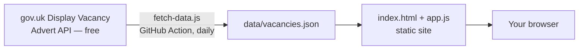

# UK Apprenticeship Board

A free, static job board listing UK apprenticeships — searchable and
filterable by sector, location, and level.

## Why this doesn't scrape Indeed/Reed/Totaljobs/etc.

You asked for scraping, but that's not the right tool here, and I built
something better instead. Think of it like this: instead of sending someone
to peek through the windows of a dozen different shops to jot down what's
for sale (which those shops explicitly ban in their small print, and can get
you IP-banned or sued), there's a public noticeboard the UK government
already runs, that every genuine apprenticeship **must** legally be posted
to. So instead of window-peeking, this project just reads the noticeboard
directly, using the official free API built for exactly that purpose:

- Indeed, Reed and Totaljobs all prohibit automated scraping in their Terms
  of Service and block it via `robots.txt` — doing it anyway risks legal
  action and IP bans, and isn't something to build for you.
- The Department for Education runs **Find an apprenticeship**
  (<https://www.gov.uk/apply-apprenticeship>), and every employer/training
  provider offering a real, registered UK apprenticeship must advertise it
  there. DfE also publishes a free, public **Display Vacancy Advert API**
  specifically so other sites can show these vacancies.
- Net result: this board is legal, free, and actually has *better* coverage
  of genuine apprenticeships than scraping any single commercial site would.

## How it works



- `scripts/fetch-data.js` — a small Node script that calls the official API
  and writes normalised results to `data/vacancies.json`.
- `index.html` / `app.js` / `styles.css` — a dependency-free static site
  that reads that JSON file and renders the searchable board. No server,
  no database, no framework.
- `.github/workflows/update-apprenticeships.yml` — a GitHub Action (free on
  GitHub's free tier) that re-runs the fetch script every day so listings
  stay current, and commits the refreshed data automatically.

The board ships with realistic **sample data** (`data/vacancies.sample.json`,
copied to `data/vacancies.json`) so it works immediately, with no setup.

## Getting live data (free)

1. Create a free account at
   <https://developer.apprenticeships.education.gov.uk/> and subscribe to
   the **Display vacancy advert API** product to get a subscription key.
2. Set it locally and run the fetch script:
   ```bash
   export APPRENTICESHIP_API_KEY="your-key-here"
   node scripts/fetch-data.js
   ```
3. For automatic daily refreshes, add the same key as a repository secret
   named `APPRENTICESHIP_API_KEY` (Settings → Secrets and variables →
   Actions) — the included workflow will pick it up.

> **Note:** the exact JSON field names returned by the live API couldn't be
> verified from this environment (the developer portal requires a signed-in
> browser session and isn't reachable from here). `fetch-data.js` maps
> several likely field-name spellings defensively and logs what it fetches —
> run it once with a real key, check `data/vacancies.json`, and adjust the
> `pick(...)` calls in `normalizeVacancy()` if any field comes through empty.
> The Swagger docs under the "Documentation" tab on the developer portal
> show the current schema.

## Running it locally

No build step needed — just serve the folder statically:

```bash
npx http-server apprenticeship-board -p 8080
# then open http://localhost:8080
```

(Opening `index.html` directly with `file://` also mostly works, but some
browsers block `fetch()` for local files — a static server avoids that.)

## Deploying for free

Any static host works. The simplest free option with this repo:

1. Push this folder to GitHub (already done if you're reading this from the
   repo).
2. In repo Settings → Pages, set the source to the branch and `/apprenticeship-board`
   folder (or move these files to a dedicated `gh-pages`/`docs` setup per
   GitHub's Pages docs).
3. GitHub Pages hosting is free; the Actions workflow above keeps the data
   fresh for free too.

## Customising

- Filters (sector/location/level) are generated automatically from whatever
  is in `data/vacancies.json` — no code changes needed when new values
  appear.
- Styling lives in `styles.css` and supports light/dark automatically via
  `prefers-color-scheme`.
